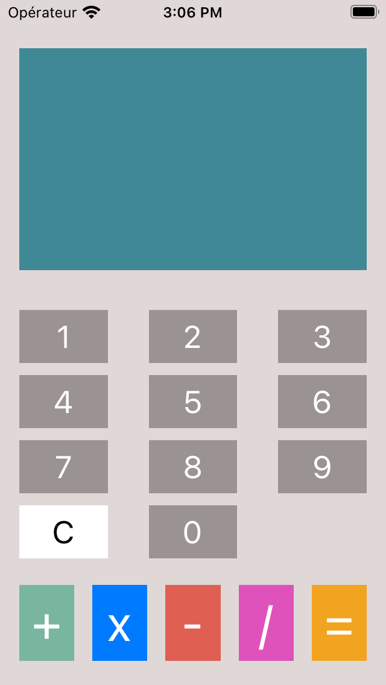
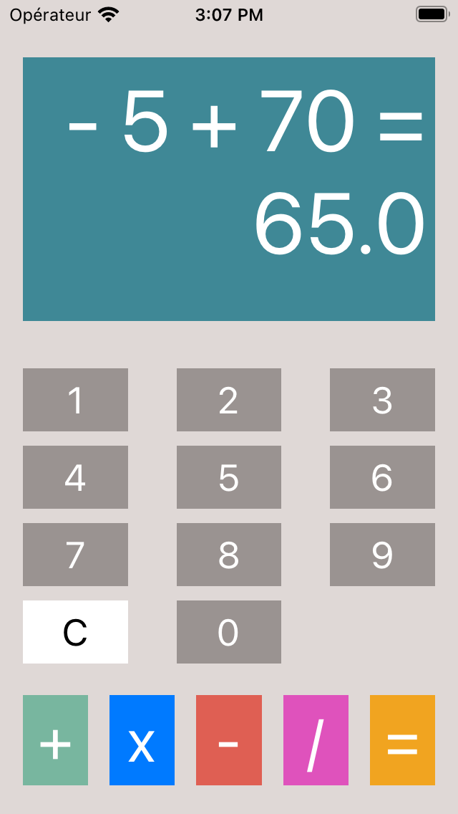

# Projet-5
calculator practice (CountOnMe)

Parcours développeur d'application iOS

OpenClassrooms

Projet 5 Améléliorer une application existante 

# Count on me 
This project is for my school OpenclassRooms

The application is a exercice for learn débogueur and logic with model   

The application is used to :  
- compute any expression

 

